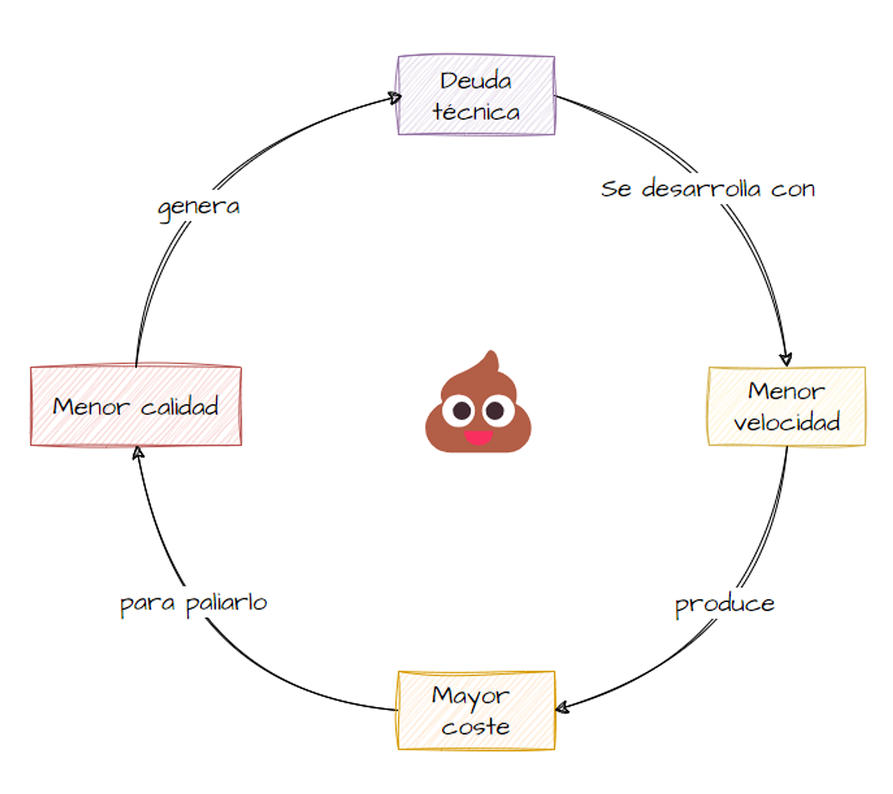

## La Deuda Técnica: Una Realidad Ineludible en el Desarrollo de Software

### Introducción
La deuda técnica es un concepto que describe el costo acumulado por decisiones de diseño y código que priorizan la velocidad de entrega sobre la calidad. Es una realidad inevitable para los equipos de desarrollo de software y, aunque no se pueda eliminar del todo, su gestión eficaz es clave para mantener la sostenibilidad y la productividad a largo plazo.

### Relación con la Refactorización de Código, los Code Smells y el Clean Code

La deuda técnica se manifiesta en diversas formas, muchas veces sutiles, pero siempre con un impacto tangible en la calidad del software. Entre los pilares fundamentales para su gestión están la refactorización de código, la identificación de code smells y la aplicación de principios de clean code.

La **refactorización de código** es una **herramienta imprescindible para reducir la deuda técnica**. Consideremos el 
caso 
de un método de 300 líneas (“God Method”) que concentra demasiada lógica en un solo lugar. Al dividirlo en varios métodos pequeños, cada uno con una responsabilidad clara, no solo mejoramos la legibilidad del código, sino también facilitamos futuras modificaciones y pruebas. Este proceso, aunque requiere tiempo, previene la acumulación de problemas que podrían convertirse en barreras infranqueables en el futuro.

Por su parte, los **code smells** actúan como **indicadores tempranos de deuda técnica**. Por ejemplo, una clase que 
centraliza demasiadas responsabilidades (“God Class”) se vuelve propensa a errores y difícil de mantener. Detectar este olor en el código podría llevarnos a aplicar el principio de “responsabilidad única”, dividiendo la clase en módulos más pequeños y especializados. Otro ejemplo común es el uso de nombres genéricos o ambiguos, como `x` o `data`, que podrían sustituirse por nombres descriptivos como `numeroDeIntentos` o `resultadoProcesado`. Estas mejoras no solo benefician al equipo actual, sino también a futuros desarrolladores que trabajen con ese sistema.

El **clean code**, con su **énfasis en la claridad, la simplicidad y buenas prácticas**, es la filosofía que cierra el 
círculo. 
Imaginemos un 
sistema donde se utiliza una combinación de métodos bien nombrados, estructuras coherentes y comentarios solo cuando son absolutamente necesarios. Este enfoque reduce el tiempo necesario para comprender y trabajar con el código, disminuyendo significativamente la posibilidad de errores humanos. En definitiva, la aplicación de clean code evita que la deuda técnica crezca de manera exponencial.

### Gestión de la Deuda Técnica en Metodologías Ágiles

En el contexto de las metodologías ágiles, la deuda técnica se convierte en una preocupación constante. Para 
gestionarla eficazmente, es **fundamental integrarla en la dinámica del equipo y en los procesos del desarrollo**.

Un enfoque clave es **hacer visible** la deuda técnica, **incluyéndola en la lista de tareas del sprint**. 
Imaginemos un escenario donde el equipo decide refactorizar un módulo crítico antes de agregar una nueva funcionalidad. Al registrar esta actividad como parte del backlog, el equipo asegura que la gestión de la deuda técnica recibe la misma prioridad que cualquier otra historia de usuario.

Las **pruebas automatizadas** también desempeñan un papel crucial. Al implementar pruebas unitarias y de integración, 
los desarrolladores pueden refactorizar el código con confianza, **sabiendo que cualquier cambio que introduzca 
errores será detectado de inmediato**. Por ejemplo, al trabajar en un sistema de facturación, podría escribirse un 
conjunto de pruebas que validen la correcta aplicación de impuestos antes y después de la refactorización.

El uso de **herramientas como SonarQube** permite **medir la deuda técnica de manera cuantitativa**, asignando un valor 
estimado al esfuerzo necesario para resolverla. Estas herramientas no solo identifican áreas problemáticas, sino que también generan reportes visuales que facilitan la toma de decisiones por parte del equipo. Por ejemplo, si SonarQube indica que un módulo tiene un "costo de refactorización" elevado, podría priorizarse su mejora antes de continuar con nuevas funcionalidades.

Finalmente, las **retrospectivas** de sprint ofrecen una oportunidad para **evaluar el impacto de la deuda técnica 
acumulada y ajustar estrategias** según sea necesario. Si un equipo observa que las revisiones de código han 
identificado repetidamente los mismos problemas, podría decidir dedicar un sprint específico a abordar estas cuestiones, asegurándose de no perpetuar malas prácticas.

### Beneficios de una Buena Gestión de la Deuda Técnica

La gestión proactiva de la deuda técnica ofrece beneficios tangibles y sostenibles. **Un código limpio y bien 
estructurado reduce drásticamente los tiempos de desarrollo** futuro, **permitiendo que los equipos se concentren en 
innovar en lugar de lidiar con problemas heredados**. Además, mejora la calidad del producto final, generando 
confianza tanto en los usuarios como en los desarrolladores.

Trabajar en un entorno donde la deuda técnica está bajo control también tiene un impacto positivo en la moral del 
equipo. **Los desarrolladores sienten una mayor satisfacción al trabajar con sistemas que son fáciles de entender y 
modificar**, lo que a su vez contribuye a una mayor retención del talento y a una cultura de calidad en el desarrollo.

### Conclusión
La deuda técnica es una realidad inevitable, pero no inmanejable. Incorporar estrategias proactivas y sistemáticas para su gestión dentro de metodologías ágiles permite a los equipos balancear efectivamente la velocidad de entrega y la calidad del software, asegurando un desarrollo sostenible y exitoso a largo plazo.
